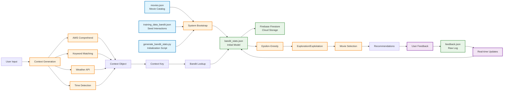
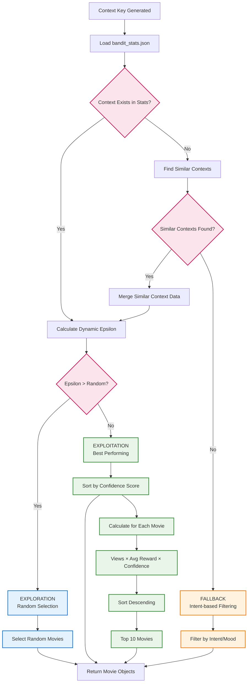
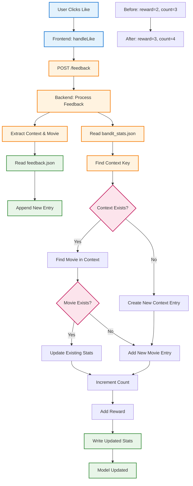

# Fire TV Recommendation System - Complete Data Flow & Training Flowchart

## 🔄 Complete System Flowchart

```mermaid
graph TD
    %% User Interaction Phase
    A[User Opens App] --> B{First Visit?}
    B -->|Yes| C[Show Popup Flow]
    B -->|No| D[Direct to Recommendations]
    
    %% Popup Flow
    C --> E[Step 1: How was your day?]
    E --> F[User Response: Good/Bad/Okay]
    F --> G[Step 2: What are you up to?]
    G --> H[User Response: watch movie/relax/focus]
    H --> I{Intent = Focus?}
    I -->|Yes| J[Step 3: Specific task?]
    I -->|No| K[Generate Context]
    J --> L[User Input: cooking/workout]
    L --> K
    
    %% Context Generation
    K --> M[Backend: _generate_context_logic]
    M --> N[AWS Comprehend: Sentiment Analysis]
    N --> O[Mood: Positive/Negative/Neutral]
    M --> P[Keyword Matching: Intent Detection]
    P --> Q[Intent: Entertainment/Focus/Relaxation]
    M --> R[Weather API: Environmental Context]
    R --> S[Weather: Sunny/Rainy/Cloudy]
    M --> T[Time Detection: Local Time]
    T --> U[Time: Morning/Afternoon/Evening/Night]
    
    %% Context Assembly
    O --> V[Context Object Assembly]
    Q --> V
    S --> V
    U --> V
    V --> W[Context Key: mood|intent|sub_intent|weather|time]
    
    %% Bandit Decision Making
    W --> X[Load bandit_stats.json]
    X --> Y{Context Exists?}
    Y -->|Yes| Z[Epsilon-Greedy Decision]
    Y -->|No| AA[Similarity Search]
    AA --> BB{Similar Contexts Found?}
    BB -->|Yes| Z
    BB -->|No| CC[Fallback Recommendation]
    
    %% Epsilon-Greedy Logic
    Z --> DD{Exploration vs Exploitation}
    DD -->|Exploration 10-30%| EE[Random Movie Selection]
    DD -->|Exploitation 70-90%| FF[Best Performing Movies]
    
    %% Movie Selection
    EE --> GG[Movie Details Lookup]
    FF --> GG
    CC --> GG
    GG --> HH[Load from movies.json]
    HH --> II[Return 10 Movie Objects]
    
    %% Frontend Display
    II --> JJ[Frontend: Display Recommendations]
    JJ --> KK[User Views Recommendations]
    KK --> LL{User Provides Feedback?}
    LL -->|Yes| MM[User Likes/Dislikes Movie]
    LL -->|No| NN[Session Ends]
    
    %% Learning Loop
    MM --> OO[Frontend: POST /feedback]
    OO --> PP[Backend: Process Feedback]
    PP --> QQ[Log to feedback.json]
    PP --> RR[Read bandit_stats.json]
    RR --> SS[Update Movie Statistics]
    SS --> TT[Increment Count]
    SS --> UU[Add Reward]
    TT --> VV[Write Updated bandit_stats.json]
    UU --> VV
    VV --> WW[Model Updated for Next User]
    WW --> NN
    
    %% Styling
    classDef userInteraction fill:#e3f2fd,stroke:#1976d2,stroke-width:2px
    classDef backend fill:#fff3e0,stroke:#f57c00,stroke-width:2px
    classDef data fill:#e8f5e8,stroke:#388e3c,stroke-width:2px
    classDef decision fill:#fce4ec,stroke:#c2185b,stroke-width:2px
    classDef learning fill:#f3e5f5,stroke:#7b1fa2,stroke-width:2px
    
    class A,B,C,D,E,F,G,H,I,J,K,L userInteraction
    class M,N,O,P,Q,R,S,T,U,V,W,X,Z,AA,BB,CC,DD,EE,FF,GG,HH,II backend
    class QQ,RR,SS,TT,UU,VV,WW learning
    class Y,LL decision
    class JJ,KK,MM,OO,PP data
```

## 📊 Detailed Training Data Flow



## 🧠 Bandit Algorithm Decision Tree



## 🔄 Real-Time Learning Loop



## 📈 Context Generation Pipeline

```mermaid
graph LR
    A[Raw User Input] --> B[Text Processing]
    B --> C[Mood Analysis]
    B --> D[Intent Detection]
    B --> E[Sub-Intent Detection]
    
    C --> F[AWS Comprehend API]
    F --> G[Sentiment Score]
    G --> H[Mood Classification]
    
    D --> I[Keyword Matching]
    I --> J[Intent Classification]
    
    E --> K[Sub-Intent Keywords]
    K --> L[Sub-Intent Classification]
    
    H --> M[Context Assembly]
    J --> M
    L --> M
    
    N[Weather API] --> O[Environmental Context]
    P[Time Detection] --> Q[Temporal Context]
    
    O --> M
    Q --> M
    
    M --> R[Final Context Object]
    R --> S[Context Key Generation]
    
    %% Example Context
    T[Input: "Good day, want to watch something"] --> U[Context: Positive|Entertainment||Sunny|Evening]
    
    %% Styling
    classDef input fill:#e3f2fd,stroke:#1976d2,stroke-width:2px
    classDef processing fill:#fff3e0,stroke:#f57c00,stroke-width:2px
    classDef output fill:#e8f5e8,stroke:#388e3c,stroke-width:2px
    classDef external fill:#f3e5f5,stroke:#7b1fa2,stroke-width:2px
    
    class A,T input
    class B,C,D,E,F,I,K processing
    class M,R,S,U output
    class N,P external
```

## 🎯 Key Insights from the Flowcharts

### 1. **Multi-Phase Learning System**
- **Bootstrap Phase**: Initial model creation from seed data
- **Live Phase**: Real-time learning from user interactions
- **Continuous Phase**: Ongoing model refinement

### 2. **Intelligent Decision Making**
- **Context Awareness**: 5-dimensional context understanding
- **Dynamic Exploration**: Adaptive learning rates
- **Fallback Mechanisms**: Robust error handling

### 3. **Data Flow Efficiency**
- **In-Memory Processing**: Fast movie lookups
- **JSON Storage**: Simple, portable data format
- **Real-time Updates**: Immediate feedback integration

### 4. **Scalability Considerations**
- **Context Explosion**: 5 dimensions create many combinations
- **Memory Management**: All movies loaded in memory
- **File I/O**: Frequent bandit_stats.json updates

### 5. **User Experience Flow**
- **Progressive Disclosure**: Step-by-step context collection
- **Voice Integration**: Natural language input
- **Immediate Feedback**: Real-time recommendation updates

This comprehensive flowchart visualization demonstrates the sophisticated nature of your recommendation system, showing how it balances immediate user needs with long-term learning objectives through intelligent exploration and exploitation strategies. 